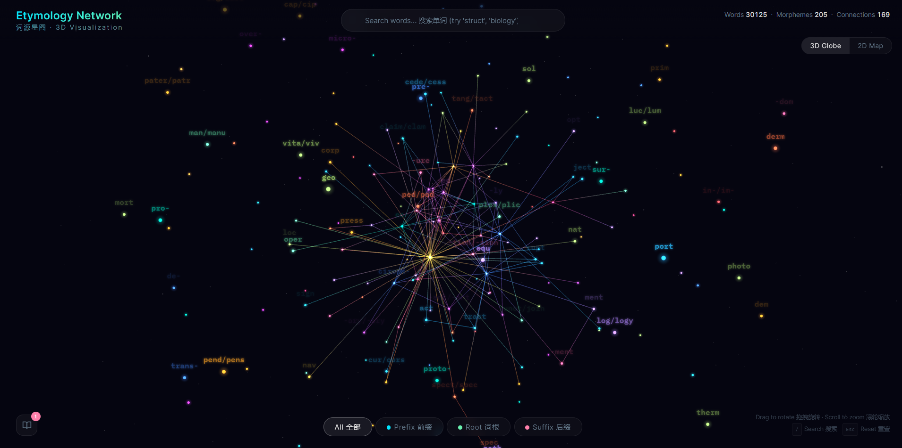
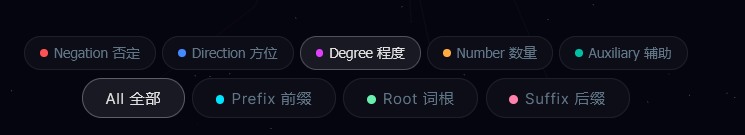

<div align="center">

# Etymology Network 词源星图

**看见英语单词之间的联系 — 一张活的语言网络**

[](https://yunningtang.github.io/EtymologyNetwork3D/)
[]()
[]()
[]()

<br/>

*通过前缀、词根、后缀，用交互式 3D/2D 可视化探索英语词源。*
*专为中文母语者学习英语词汇设计。*

<br/>

### [>>> 立即体验在线版 <<<](https://yunningtang.github.io/EtymologyNetwork3D/)

<br/>





</div>

---

## 核心功能

| 功能 | 说明 |
|------|------|
| **3D 星图** | 在 WebGL 驱动的星空中浏览词素之间的连接关系，支持旋转、缩放、平滑镜头 |
| **2D 思维导图** | 层级辐射布局 — 逐层展开分组、词素、单词 |
| **智能搜索** | 30,000+ 词汇即时搜索，支持中英双语，下拉实时匹配 |
| **单词详情** | 点击任意单词查看词源拆解、词素构成、中文释义 |
| **发音朗读** | 内置 Text-to-Speech，点击即可听到单词发音 |
| **收藏夹** | 收藏感兴趣的单词，追踪学习进度 |
| **分类筛选** | 按 Prefix / Root / Suffix 筛选，支持细分子类别（否定、方向、动作等） |
| **双语界面** | 全程中英文对照 |

## 快速开始

**方式一 — 浏览器直接打开**
> 打开 [`index.html`](index.html) 即可使用，无需服务器。

**方式二 — Electron 桌面应用**
```bash
git clone https://github.com/yunningtang/EtymologyNetwork3D.git
cd EtymologyNetwork3D
npm install
npm start
```

## 产品逻辑

```
浏览 / 搜索  →  理解（词源拆解）  →  练习（发音朗读）  →  记忆（收藏 + 进度追踪）
```

每个英语单词都由 **morphemes（词素）** 构成 — 来自拉丁语、希腊语和古英语的最小意义单元。本工具将这些联系可视化呈现：

- **Prefixes 前缀**（`pre-`, `un-`, `re-`）— 修饰方向或程度
- **Roots 词根**（`struct`, `ject`, `duct`）— 承载核心语义
- **Suffixes 后缀**（`-tion`, `-ly`, `-able`）— 决定词性

探索一个词素，就能发现数十个相关单词。在整个词汇体系中看到规律。

## 技术栈

| 层级 | 技术方案 |
|------|---------|
| 3D 渲染 | **Three.js** r128 — 自定义 GLSL Shader、Point Sprites、Additive Blending |
| 2D 可视化 | **Canvas 2D** — 辐射式思维导图 + 碰撞避免算法 |
| 桌面端 | **Electron** v28 |
| 架构 | Single-file HTML — 所有 CSS/JS 内嵌，零依赖部署 |
| 数据 | 200+ 词素，30,000+ 单词及词源映射 |
| 存储 | `localStorage` 持久化收藏夹和学习进度 |

## 项目结构

```
EtymologyNetwork3D/
├── public/
│   └── index.html          # 主应用（单文件应用）
├── index.html               # GitHub Pages 入口
├── main.js                  # Electron 主进程
├── package.json
├── data/
│   └── etymology.db         # 词源数据库
└── scripts/
    ├── build-html.js         # HTML 构建脚本
    ├── build-vocabulary.js   # 词汇处理脚本
    ├── embed-words.js        # 单词数据嵌入
    └── scrape-words.js       # 单词爬取脚本
```

## 17 大语义分类

词素网络按颜色编码分为以下语义组：

> **Create 创造** · **Action 动作** · **Sense 感知** · **Mind 认知** · **Language 语言** · **Nature 自然** · **Society 社会** · **Number 数量** · **Direction 方向** · **Negation 否定** · **Degree 程度** · **Noun 名词** · **Adj 形容词** · **Verb 动词** · **Adv 副词** · **Auxiliary 辅助** · **Fidelity 忠诚**

---

<div align="center">

### 作者

**Yunning Tang** · [tangyunning27@gmail.com](mailto:tangyunning27@gmail.com)

<br/>

MIT License

</div>
