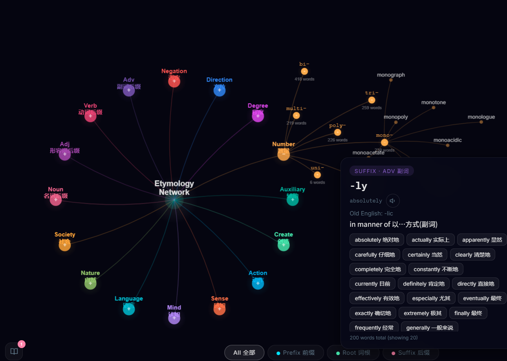

# Etymology Network 词源星图

An interactive 3D/2D visualization tool for exploring English word origins through morphemes (prefixes, roots, suffixes). Designed for Chinese learners studying English vocabulary.

**30,000+ words | 200+ morphemes | 17 semantic categories**



## Features

- **3D Globe View** - Explore morpheme connections in an interactive WebGL 3D star-map
- **2D Mind Map** - Hierarchical radial layout for systematic browsing
- **Smart Search** - Bilingual search across 30k+ words with instant dropdown results
- **Word Details** - Click any word to see etymology breakdown, morpheme composition, and Chinese meanings
- **Pronunciation** - Built-in text-to-speech for vocabulary practice
- **Favorites & Progress** - Save words and track your learning progress (localStorage)
- **Category Filters** - Filter by prefix/root/suffix with sub-category chips (Negation, Direction, Action, etc.)
- **Bilingual UI** - English + Chinese labels throughout

## Live Preview

Open `index.html` directly in a browser, or run as an Electron desktop app:

```bash
npm install
npm start
```

## Tech Stack

- **Three.js** (r128) - WebGL 3D rendering with custom GLSL shaders
- **Canvas 2D** - Mind map visualization and label overlay
- **Electron** (v28) - Desktop app wrapper
- **Single-file architecture** - All HTML/CSS/JS in one `index.html`

## Project Structure

```
EtymologyNetwork3D/
├── public/
│   └── index.html      # Main application (single-file app)
├── index.html           # Root copy (GitHub Pages)
├── main.js              # Electron main process
├── package.json
├── data/
│   └── etymology.db     # Source etymology database
└── scripts/
    ├── build-html.js
    ├── build-vocabulary.js
    ├── embed-words.js
    └── scrape-words.js
```

## Author

**Yunning Tang** - [tangyunning27@gmail.com](mailto:tangyunning27@gmail.com)

## License

MIT
